# MedLink EHR - Electronic Health Record System


## Overview

MedLink EHR is a comprehensive Electronic Health Record system designed specifically for Kenyan healthcare facilities. It provides a complete solution for managing patient records, appointments, laboratory results, pharmacy inventory, and hospital administration with role-based access control.

### Key Features

- Role-Based Access Control - Super Admin, Admin, Doctor, Nurse, Lab Technician, Pharmacist, Receptionist, Cashier, and Viewer roles
- Patient Management - Complete patient records, medical history, and treatment plans
- Appointment Scheduling - Manage patient appointments with real-time availability
- Triage System - Quick patient assessment and priority classification
- Laboratory Integration - Lab request management and digital results tracking
- Pharmacy Management - Inventory tracking, prescription management, and stock alerts
- Admissions Management - Bed allocation and patient admission tracking
- Reporting and Analytics - Real-time dashboards and comprehensive reports
- Audit Logging - Complete system activity tracking
- Two-Factor Authentication - Enhanced security for user accounts
- Notifications System - Real-time user notifications

## Table of Contents

- [Technology Stack](#technology-stack)
- [Installation](#installation)
- [Configuration](#configuration)
- [Database Setup](#database-setup)
- [Running the Application](#running-the-application)
- [System Architecture](#system-architecture)
- [User Roles](#user-roles)
- [Role Flow Diagrams](#role-flow-diagrams)
- [API Documentation](#api-documentation)
- [Project Structure](#project-structure)
- [Security Features](#security-features)
- [Testing](#testing)
- [Performance Optimization](#performance-optimization)
- [Troubleshooting](#troubleshooting)
- [Deployment](#deployment)
- [Contributing](#contributing)
- [License](#license)
- [Contact and Support](#contact-and-support)
- [Additional Resources](#additional-resources)

## Technology Stack

### Backend

- Django 6.0 - Python web framework
- Django REST Framework - API development
- Simple JWT - JSON Web Token authentication
- SQLite / PostgreSQL - Database
- Celery - Asynchronous task queue
- Redis - Caching and message broker

### Frontend

- Tailwind CSS - Utility-first CSS framework
- Chart.js - Interactive charts and graphs
- Font Awesome - Icon library
- FullCalendar - Appointment management

### Development Tools

- Git - Version control
- pip - Package management
- Virtual Environment - Isolated Python environment

## Installation

### Prerequisites

- Python 3.10 or higher
- pip (Python package manager)
- Virtual environment tool (venv)

### Step 1: Clone the Repository

```bash
git clone https://github.com/eKidenge/medlink-ehr.git
cd medlink-ehr
```

### Step 2: Create and Activate Virtual Environment

Windows:

```bash
python -m venv venv
venv\Scripts\activate
```

macOS/Linux:

```bash
python3 -m venv venv
source venv/bin/activate
```

### Step 3: Install Dependencies

```bash
pip install -r requirements.txt
```

### Step 4: Environment Variables

Create a `.env` file in the root directory:

```env
# Django Settings
SECRET_KEY=your-secret-key-here
DEBUG=True
ALLOWED_HOSTS=localhost,127.0.0.1

# Database
DB_ENGINE=django.db.backends.sqlite3
DB_NAME=db.sqlite3

# Email Configuration (Optional)
EMAIL_HOST=smtp.gmail.com
EMAIL_PORT=587
EMAIL_USE_TLS=True
EMAIL_HOST_USER=your-email@gmail.com
EMAIL_HOST_PASSWORD=your-password
DEFAULT_FROM_EMAIL=noreply@medlink.co.ke

# JWT Settings
JWT_ACCESS_TOKEN_LIFETIME=60
JWT_REFRESH_TOKEN_LIFETIME=1440
```

## Configuration

### Settings Configuration

Create `medlink_ehr/settings_local.py` for local settings (optional):

```python
from .settings import *

DEBUG = True
DATABASES = {
    'default': {
        'ENGINE': 'django.db.backends.sqlite3',
        'NAME': BASE_DIR / 'db.sqlite3',
    }
}
```

### Email Configuration

For email functionality, configure in `settings.py`:

```python
EMAIL_BACKEND = 'django.core.mail.backends.smtp.EmailBackend'
EMAIL_HOST = 'smtp.gmail.com'
EMAIL_PORT = 587
EMAIL_USE_TLS = True
EMAIL_HOST_USER = 'your-email@gmail.com'
EMAIL_HOST_PASSWORD = 'your-app-password'
DEFAULT_FROM_EMAIL = 'noreply@medlink.co.ke'
```

## Database Setup

### Apply Migrations

```bash
python manage.py makemigrations
python manage.py migrate
```

### Create Superuser

```bash
python manage.py createsuperuser
```

Follow the prompts to create an administrator account.

### Load Initial Data

```bash
python manage.py loaddata fixtures/initial_data.json
```

## Running the Application

### Development Server

```bash
python manage.py runserver
```

The application will be available at: http://127.0.0.1:8000/

### Access the Application

| URL | Description |
|---|---|
| `/` | Landing Page |
| `/login/` | Login Page |
| `/register/` | Registration Page |
| `/dashboard/` | User Dashboard |
| `/dashboard/admin/` | Admin Dashboard |
| `/api/` | API Root |
| `/swagger/` | API Documentation |
| `/admin/` | Django Admin Panel |

## System Architecture

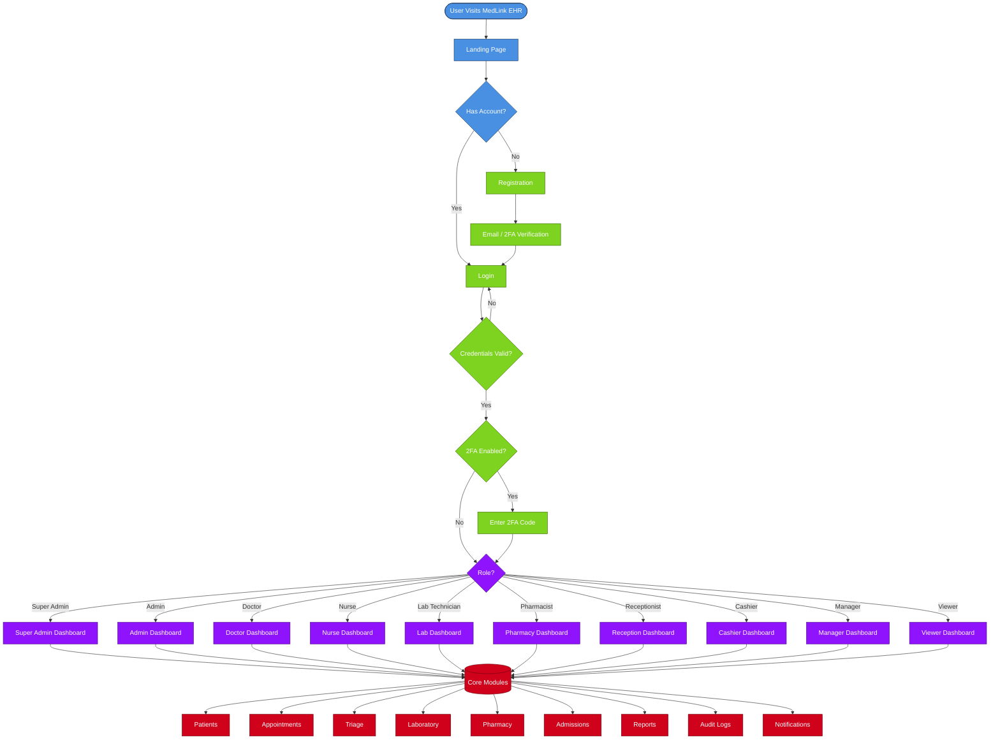

## User Roles

| Role | Dashboard URL | Permissions |
|---|---|---|
| Super Admin | `/dashboard/admin/` | Full system access, user management, settings |
| Admin | `/dashboard/admin/` | Full system access, user management |
| Doctor | `/dashboard/doctor/` | Patient management, prescriptions, lab requests |
| Nurse | `/dashboard/nurse/` | Triage, vital signs, patient care |
| Lab Technician | `/dashboard/lab/` | Lab tests, results entry, equipment management |
| Pharmacist | `/dashboard/pharmacy/` | Prescription dispensing, inventory management |
| Receptionist | `/dashboard/reception/` | Patient registration, appointments |
| Cashier | `/dashboard/cashier/` | Payment processing, invoices |
| Manager | `/dashboard/manager/` | Staff management, reports |
| Viewer | `/dashboard/viewer/` | Read-only access |

## Role Flow Diagrams

### Registration and Login Flow

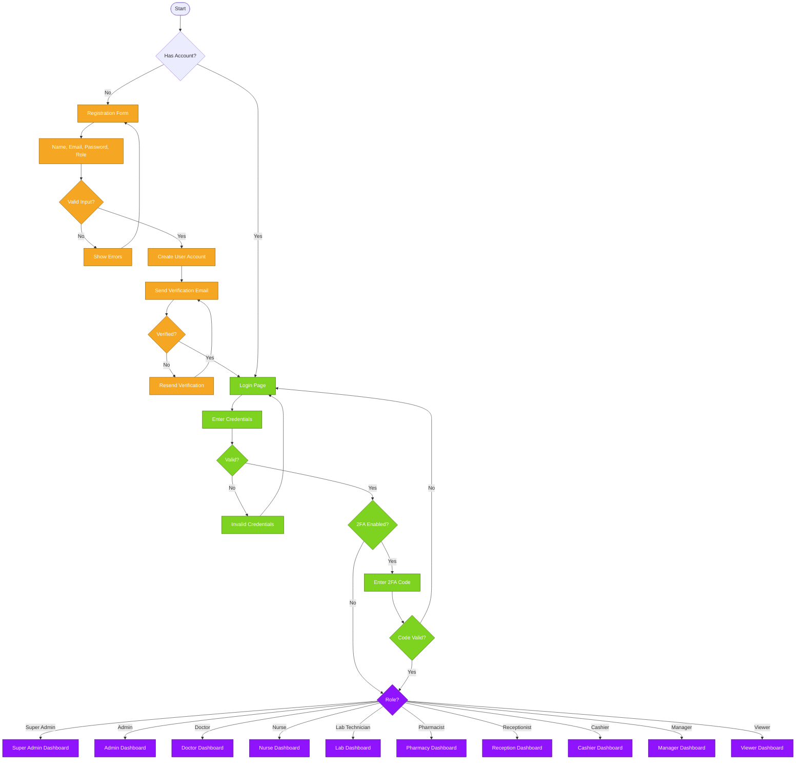

### Super Admin and Admin Flow

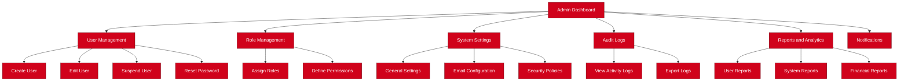

### Doctor Flow

```mermaid
flowchart TD
    A[Doctor Dashboard] --> B[My Appointments]
    A --> C[Patient Records]
    A --> D[Prescriptions]
    A --> E[Lab Requests]
    A --> F[Admissions]

    B --> B1[View Today Schedule]
    B --> B2[Start Consultation]
    B --> B3[Complete Appointment]

    C --> C1[Search Patient]
    C --> C2[View Medical History]
    C --> C3[Add Diagnosis]
    C --> C4[Update Treatment Plan]

    D --> D1[Create Prescription]
    D --> D2[Send to Pharmacy]
    D --> D3[View Prescription History]

    E --> E1[Request Lab Test]
    E --> E2[View Lab Results]
    E --> E3[Review Critical Results]

    F --> F1[Admit Patient]
    F --> F2[Update Admission Status]
    F --> F3[Discharge Patient]

    classDef doctor fill:#4A90E2,stroke:#1F3A5F,color:#fff
    class A,B,C,D,E,F,B1,B2,B3,C1,C2,C3,C4,D1,D2,D3,E1,E2,E3,F1,F2,F3 doctor
```

### Nurse Flow

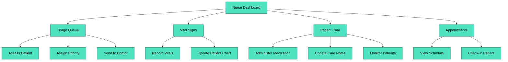

### Lab Technician Flow

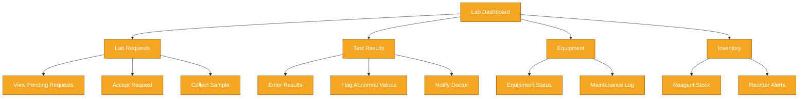

### Pharmacist Flow

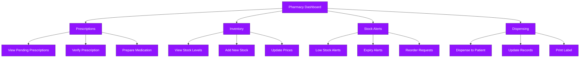

### Receptionist Flow

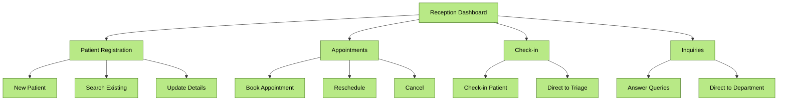

### Cashier Flow

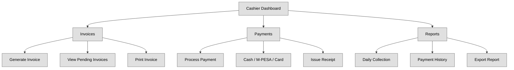

### Manager Flow

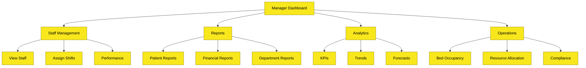

### Viewer Flow

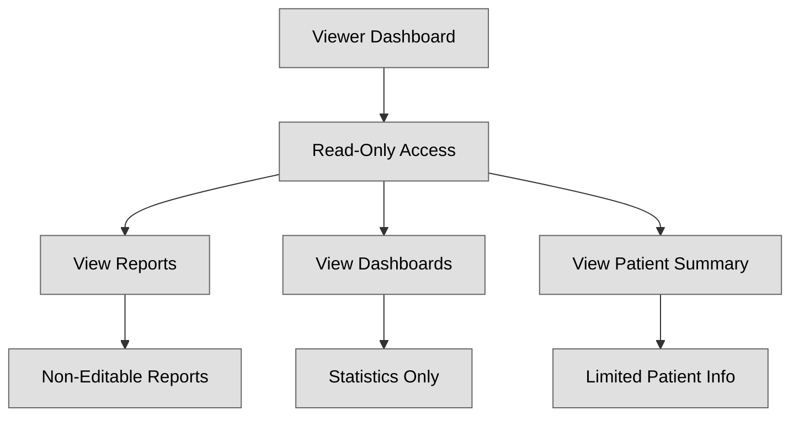

### Patient Lifecycle

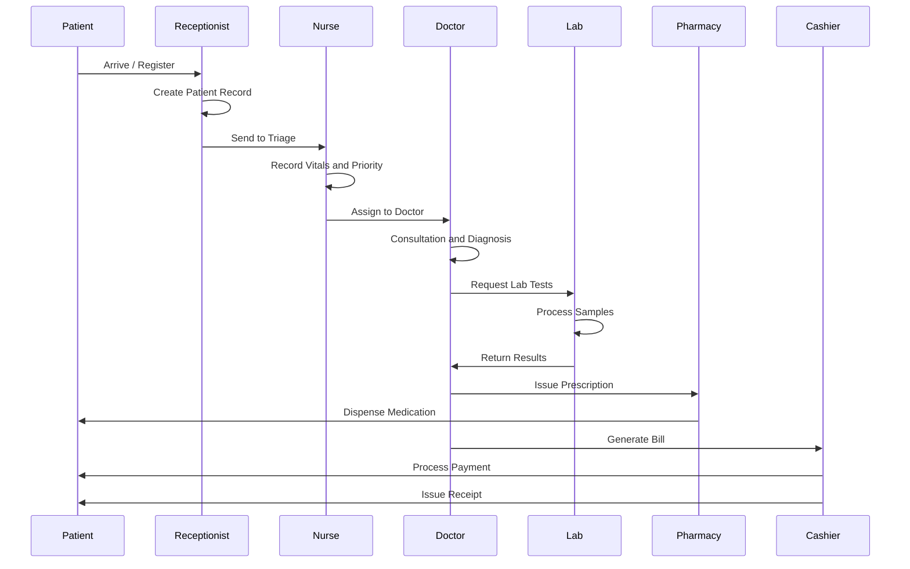

### Permission Matrix

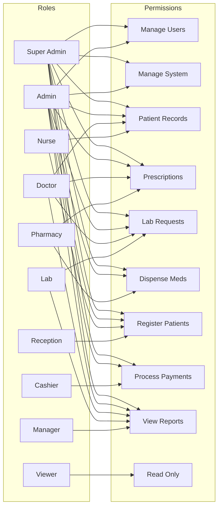

## API Documentation

### Authentication Endpoints

| Method | Endpoint | Description |
|---|---|---|
| POST | `/api/accounts/auth/login/` | User login with JWT |
| POST | `/api/accounts/auth/register/` | User registration |
| POST | `/api/accounts/auth/logout/` | User logout |
| POST | `/api/accounts/auth/verify-2fa/` | Verify 2FA code |
| POST | `/api/token/refresh/` | Refresh JWT token |
| POST | `/api/token/verify/` | Verify JWT token |

### User Management Endpoints

| Method | Endpoint | Description |
|---|---|---|
| GET | `/api/accounts/users/` | List all users |
| GET | `/api/accounts/users/{id}/` | Get user details |
| POST | `/api/accounts/users/` | Create user |
| PUT | `/api/accounts/users/{id}/` | Update user |
| DELETE | `/api/accounts/users/{id}/` | Delete user |

### Dashboard Endpoints

| Method | Endpoint | Description |
|---|---|---|
| GET | `/api/dashboard/stats/` | Dashboard statistics |
| GET | `/api/dashboard/kpis/` | Key performance indicators |
| GET | `/api/dashboard/activity/` | Recent activity feed |
| GET | `/api/dashboard/notifications/unread/` | Unread notifications |

### Patient Management Endpoints

| Method | Endpoint | Description |
|---|---|---|
| GET | `/api/patients/` | List patients |
| POST | `/api/patients/` | Create patient |
| GET | `/api/patients/{id}/` | Get patient details |
| PUT | `/api/patients/{id}/` | Update patient |

### Authentication Required

All API endpoints except `/api/accounts/auth/login/`, `/api/accounts/auth/register/`, `/api/token/refresh/`, and `/api/token/verify/` require JWT authentication.

Headers:

```
Authorization: Bearer <access_token>
```

## Project Structure

```
medlink_ehr/
├── apps/
│   ├── accounts/
│   │   ├── migrations/
│   │   ├── models.py
│   │   ├── views.py
│   │   ├── serializers.py
│   │   ├── urls.py
│   │   └── permissions.py
│   ├── dashboard/
│   │   ├── views.py
│   │   ├── urls.py
│   │   └── serializers.py
│   ├── patients/
│   │   ├── models.py
│   │   ├── views.py
│   │   └── serializers.py
│   ├── visits/
│   │   ├── models.py
│   │   └── views.py
│   └── reports/
│       ├── models.py
│       └── views.py
├── templates/
│   ├── dashboard/
│   │   ├── base_dashboard.html
│   │   ├── index.html
│   │   ├── admin_dashboard.html
│   │   ├── doctor_dashboard.html
│   │   └── viewer_dashboard.html
│   ├── index.html
│   ├── login.html
│   └── register.html
├── static/
│   ├── css/
│   ├── js/
│   └── images/
├── medlink_ehr/
│   ├── settings.py
│   ├── urls.py
│   └── wsgi.py
├── manage.py
├── requirements.txt
└── README.md
```

## Security Features

- JWT Authentication - Secure token-based authentication
- Two-Factor Authentication - Optional 2FA for enhanced security
- Role-Based Access Control - Granular permissions per role
- Session Management - Track and terminate user sessions
- Audit Logging - Complete system activity tracking
- Password Policies - Strong password requirements
- Account Lockout - Automatic lockout after failed attempts
- CSRF Protection - Cross-site request forgery protection
- SQL Injection Prevention - ORM-based queries
- XSS Protection - Escaped template variables

## Testing

### Run Tests

```bash
python manage.py test
```

### Run Specific Test

```bash
python manage.py test apps.accounts.tests
```

### Test Coverage

```bash
coverage run manage.py test
coverage report
```

## Performance Optimization

- Database Indexing - Optimized queries with indexes
- Caching - Redis caching for frequent queries
- Query Optimization - Select related and prefetch related
- Static Files - Compressed and minified assets
- CDN - Content delivery network for static files

## Troubleshooting

### Common Issues

1. Database Migration Errors

```bash
python manage.py makemigrations --merge
python manage.py migrate
```

2. Static Files Not Loading

```bash
python manage.py collectstatic --no-input
```

3. Email Not Sending

Check email configuration in `settings.py` and ensure credentials are correct.

4. Permission Issues

```bash
chmod -R 755 media/
chmod -R 755 static/
```

### Development Logs

Logs are stored in:

```
logs/
├── debug.log
├── error.log
└── access.log
```

## Deployment

### Production Checklist

- Set `DEBUG=False` in settings
- Configure proper `ALLOWED_HOSTS`
- Set up SSL certificate
- Configure production database (PostgreSQL recommended)
- Set up email backend
- Configure CDN for static files
- Set up logging and monitoring
- Regular backups
- Security audit

### Deployment Options

#### Option 1: Heroku

```bash
heroku create medlink-ehr
git push heroku main
heroku run python manage.py migrate
```

#### Option 2: AWS EC2

```bash
ssh -i key.pem ec2-user@ec2-ip-address
sudo apt update
sudo apt install nginx postgresql
# Configure and deploy
```

#### Option 3: Docker

```bash
docker build -t medlink-ehr .
docker run -d -p 8000:8000 medlink-ehr
```

## Contributing

1. Fork the repository
2. Create a feature branch (`git checkout -b feature/amazing-feature`)
3. Commit your changes (`git commit -m 'Add amazing feature'`)
4. Push to the branch (`git push origin feature/amazing-feature`)
5. Open a Pull Request

### Coding Standards

- Follow PEP 8 style guide
- Write unit tests for new features
- Update documentation accordingly
- Use meaningful commit messages

## License

This project is proprietary and confidential. Unauthorized copying, distribution, or use is strictly prohibited.

## Contact and Support

| Type | Contact |
|---|---|
| Email | support@medlink.co.ke |
| Phone | +254 700 123 456 |
| Website | https://medlink.co.ke |
| Address | Westlands, Nairobi, Kenya |

## Additional Resources

- Django Documentation - https://docs.djangoproject.com/
- Django REST Framework - https://www.django-rest-framework.org/
- Tailwind CSS - https://tailwindcss.com/
- Chart.js - https://www.chartjs.org/

MedLink EHR 2026 - Revolutionizing Healthcare Delivery in Kenya